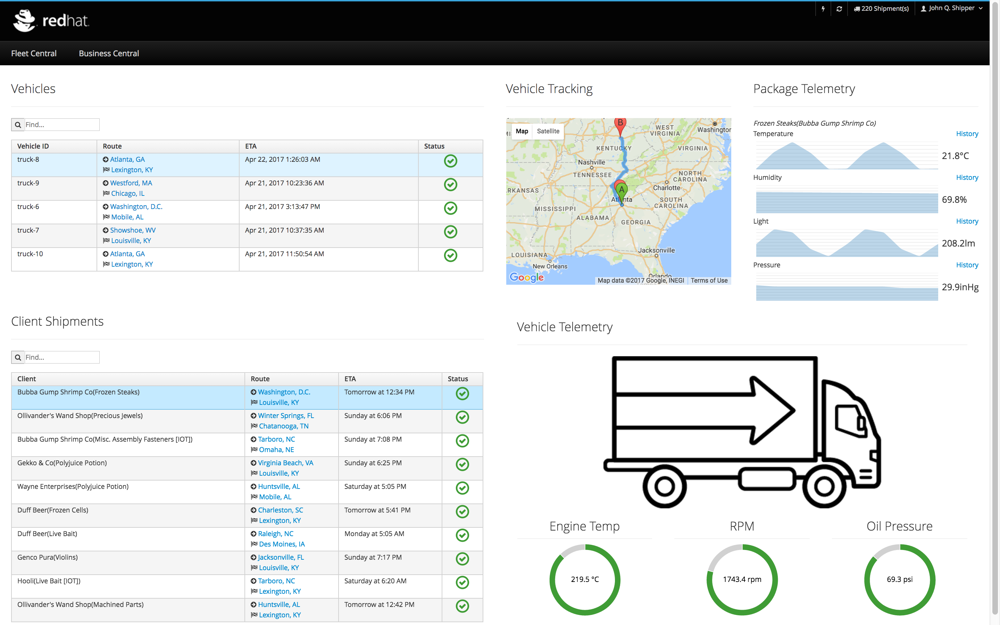
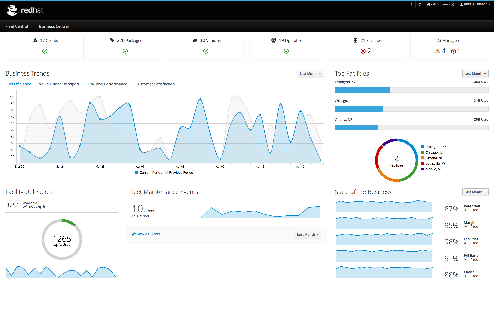

Install OpenShift and Fleet Telematics & Asset Tracking IoT Demo
================================================================
This project provides instructions for installing OpenShift and setting up of Fleet Telematics & Asset Tracking IoT Demo. 

To enable the OpenShift environment, we’ll be using CDK 3.0 (Red Hat Container Development Kit) that uses Minishift, a single-user version of OpenShift (OCP v3.5). Once OpenShift is running, you can use a web console from your browser or work from the command line with the oc command to interact with the IoT demo.

The CDK is comprised of several technologies:

**Red Hat Enterprise Linux** is the operating system installed on a VM. We will control the Minishift cluster through that installation, rather than the operating system installed on your host system (laptop).

**Kernel Virtual Machine (KVM)** technology within the linux kernel. A Virtual Machine, usually called a "VM" or "box", is a fully virtualized system running an operating system. The kernel of a KVM box is independent of the kernel on the host system. In the CDK, a KVM box running Red Hat Enterprise Linux serves as the host for a cluster of containers.

**Docker** runs a copy of an operating system in a container, except for the kernel. As a result, it can directly access hardware on the host system. It provides a higher level of security and independence from operating system changes, and helps with maintaining the same configuration across a cluster.

**OpenShift** is a system for managing docker containers on Red Hat Enterprise Linux virtual machines. A VM containing containerized apps, managed by OpenShift, is called a "pod". OpenShift deploys pods to host systems in a cluster as needed, often running more than one pod on each computer system.

**Minishift** is a version of OpenShift that runs on a single developer system, rather than a cluster of physical machines. It forms the core of the CDK. Minishift also controls the CDK installation and configuration.

Hardware requirements
---------------------
- BIOS support. The host computer system must have hardware virtualization enabled in the BIOS.
- Minimum 4GiB VM memory, recommend >8GiB memory
- Minimum 2 vCPUs, recommend 4+ vCPUs

Hypervisor requirements
-----------------------
The CDK requires a hypervisor to start the virtual machine on which the OpenShift cluster is provisioned. Make sure that the hypervisor of your choice is installed and enabled on your system before you start the CDK.

Minishift embeds VirtualBox and VMware Fusion drivers so no additional steps are required to use them. However, other drivers (KVM and Xhyve) require manual installation. 

Depending on your host OS, you have the choice of the following hypervisors:

**Mac**
- xhyve (default)
- VirtualBox

**Red Hat Enterprise Linux**
- KVM (default)
- VirtualBox

***Note: You'll also need a RHN account or a Red Hat Developer account.***

Install the hypervisor on RHEL
------------------------------------------

Install libvirt and qemu-kvm
```
$ sudo yum install libvirt qemu-kvm
```

Add yourself to the libvirt group so that you do not need to use sudo:
```
$ sudo usermod -a -G libvirt $USER
```

Update your current session to apply the group change:
```
$ newgrp libvirt
```

Install the Docker Machine
```
$ curl -L https://github.com/docker/machine/releases/download/v0.10.0/docker-machine-`uname -s`-`uname -m` >/tmp/docker-machine
$ chmod +x /tmp/docker-machine
$ sudo mv /tmp/docker-machine /usr/local/bin/docker-machine
```

Install the Docker Machine KVM driver
```
$ curl -L https://github.com/dhiltgen/docker-machine-kvm/releases/download/v0.8.2/docker-machine-driver-kvm >/tmp/docker-machine-driver-kvm
$ chmod +x /tmp/docker-machine-driver-kvm
$ sudo mv /tmp/docker-machine-driver-kvm /usr/local/bin/docker-machine-driver-kvm
```


Install the hypervisor on a Mac
-------------------------------

Install the latest version of the driver with brew:

```
$ brew install docker-machine-driver-xhyve
```

*docker-machine-driver-xhyve need root owner and uid*
```
$ sudo chown root:wheel $(brew --prefix)/opt/docker-machine-driver-xhyve/bin/docker-machine-driver-xhyve
$ sudo chmod u+s $(brew --prefix)/opt/docker-machine-driver-xhyve/bin/docker-machine-driver-xhyve
https://github.com/zchee/docker-machine-driver-xhyve#install
```

Download & Install Minishift
----------------------------

Download CDK 3.0
```
$ sudo mv ./cdk-3.0.minishift-* /usr/bin/minishift 
$ sudo chmod +x /usr/bin/minishift
$ minishift setup-cdk
```

Configure Minishift
```
$ minishift config set memory 9176
$ minishift config set cpus 4
```

Start Minishift 
```
$ minishift --username=<Red Hat username> --password=<Red Hat password> start
```
Please use the username and password associated with your RHN Account

To use a specific hypervisor, use the switch --vm-driver e.g. 
```
$ minishift --username=<Red Hat username> --password=<Red Hat password> --vm-driver=xhyve start
```

Set up the Demo
Once OpenShift is installed and running, follow the instructions below to set up the Fleet Telematics & Asset Tracking IoT Demo:

Clone the demo repo
```
$ git clone https://github.com/redhat-iot/summit2017
$ cd summit2017
```

Create a new OpenShift project and deploy the demo components
```
$ oc new-project redhat-iot --display-name="Red Hat IoT Demo"
$ oc policy add-role-to-user view system:serviceaccount:$(oc project -q):default -n $(oc project -q)
$ ./openshift-deploy.sh
```

Add imagestream definitions for wildfly and jboss-datagrid 
```
$ oc login -u system:admin
$ oc create -n openshift -f https://raw.githubusercontent.com/jboss-openshift/application-templates/master/jboss-image-streams.json
$ oc create -n openshift -f https://raw.githubusercontent.com/openshift/origin/master/examples/image-streams/image-streams-centos7.json
oc start-build dashboard --follow
```

This is an example IoT demo showing a realtime updating dashboard of data streaming from an
IoT gateway device (based on Eclipse Kura) through an Eclipse Kapua-based instance.

It demonstrates realtime fleet telematics, package tracking, alerting, and a telemetry dashboard showing critical measurements of packages in transit, including temperature, humidity, displacement, light levels, etc.




Once everything is up and running, you can access the demo using the URL of the `dashboard` route,
for example `http://dashboard-redhat-iot.domain`

Confirm that all the components are running successfully:

```
oc get pods --show-all=false
```
You should see the following pods and their status:

|NAME                 |   READY     | STATUS  |
|---------------------|:-----------:|:-------:|
|dashboard-1-xxx      |    1/1      | Running |
|datastore-1-xxx      |    1/1      | Running |
|datastore-proxy-1-xxx|    1/1      | Running |
|elasticsearch-1-xxx  |    1/1      | Running |
|kapua-api-1-wc1l7    |    1/1      | Running |
|kapua-broker-1-xxx   |    1/1      | Running |
|kapua-console-1-xxx  |    1/1      | Running |
|simulator-1-xxx      |    1/1      | Running |
|sql-1-xxx            |    1/1      | Running |

Eclipse Kapua API Documentation
-------------------------------
Eclipse Kapua exposes a REST API which can be used to access Kapua data and invoke Kapua operations. The REST API application is running as a dedicated Java process.

For example, to use the `curl` command login to Eclipse Kapua and retrieve an authentication token:

```
curl -X POST --header 'Content-Type: application/json' --header 'Accept: application/json' -d '{"password": ["your_password"], "username": "your_username"}' 'http://api-redhat-iot.domain/v1/authentication/user'
```

Once logged in, the retrieved token can be passed for future API calls, e.g.

```
curl -X GET --header 'Content-Type: application/json' --header 'Accept: application/json' --header 'Authorization: Bearer <AUTH_TOKEN_HERE>' http://api-redhat-iot.domain/v1/my_scope/devices
```

The complete API documentation can accessed using the URL of the `api` route, for example `http://api-redhat-iot.domain/doc`. More information on the REST API can be found in the [Eclipse Kapua user guide](http://download.eclipse.org/kapua/docs/develop/user-manual/en/rest.html).

Uninstalling and cleaning up project
------------------------------------
```
oc delete all --all -n redhat-iot && oc delete configmap hawkular-openshift-agent-kapua data-simulator-config -n redhat-iot
```
This will delete everything but the project "Red Hat IoT". This is suitable for testing new scripts, template,
etc.

Troubleshooting
---------------
**Missing Telemetry data**

If the telemetry data is not showing up then the dashboard app will need to be rebuilt on your local instances with the following command:
```
oc start-build dashboard —follow
```
